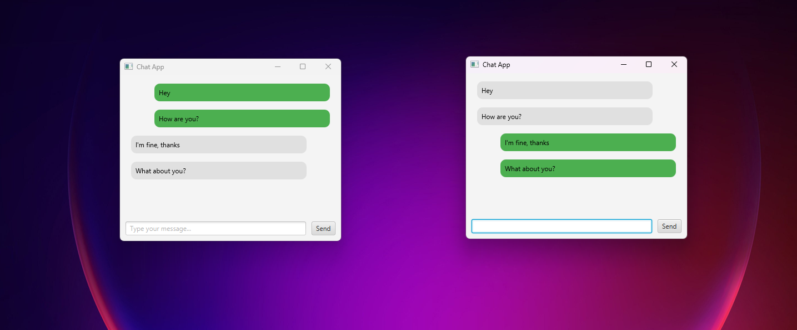

# 💬 JavaFX WebSocket Chat Application

This is a simple real-time chat application built using **JavaFX** for the UI and **Jakarta WebSockets (Tyrus)** for
server-client communication. The app supports sending and receiving messages between multiple users over a WebSocket
connection.

---

## ✨ Features

- Real-time messaging using WebSocket
- JavaFX GUI with input field and chat display
- Distinguishes your messages (right-aligned) from others' messages (left-aligned)
- Multiple clients can join the chat via `ws://localhost:8025/chat`

---

## 🖼️ Screenshots

| Screens                                                                                    
|--------------------------------------------------------------------------------------------
|  

---

## 🚀 Getting Started

### 1. Run the Server

Start the WebSocket server by running:

```bash
ChatServer.java
```

It will start a WebSocket server at ws://localhost:8025/chat.

### 2. Run the Client

Launch one or more instances of the JavaFX client:

```bash
ChatClient.java
```

Each client can send and receive messages in real time.

## 🛠️ Tech Stack

- Java 21

- Jakarta WebSocket (Tyrus 2.1.2)

- Maven

## 📌 Notes
- You can test locally by running the server once and multiple client instances from IntelliJ or terminal.

- Messages are styled based on sender:

- Client messages appear on the right

- Other users' messages appear on the left

## 👤 Author
**BARNOCH Anas** - _Java Developer & Student_

Email: [anasbarnoch@gmail.com]<br>
GitHub: [https://github.com/anasbrn]<br>


